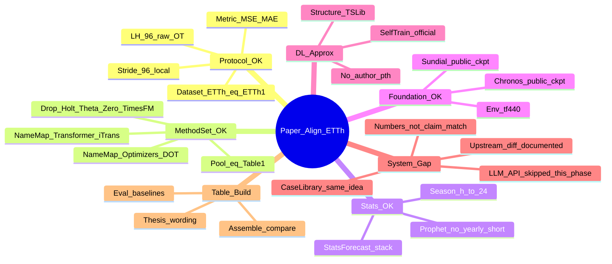
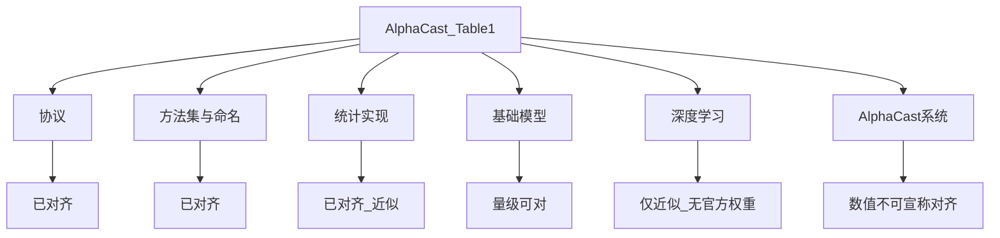
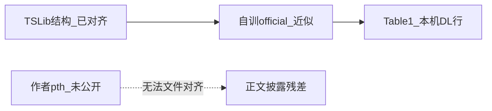
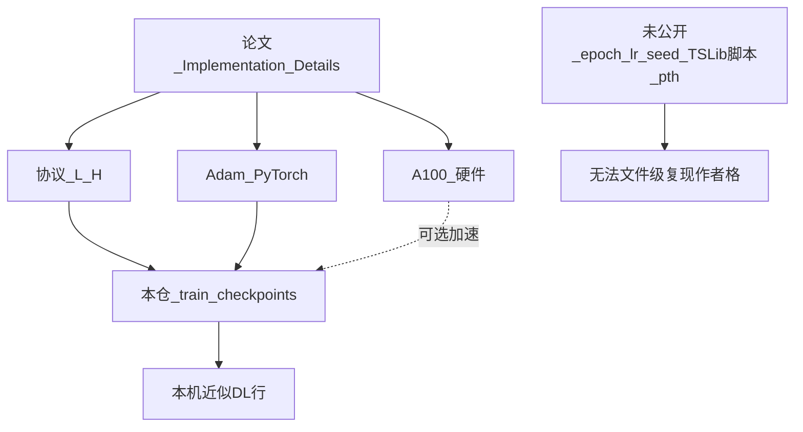
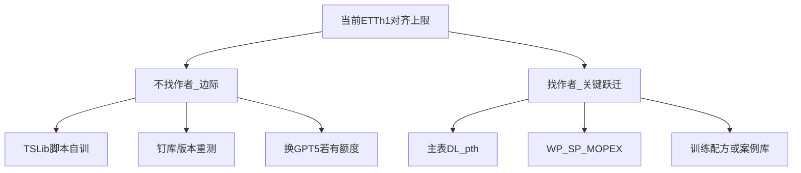

# 与论文对齐：思维导图与逐步操作

目标：本机复现在**能对齐的维度**上对齐 AlphaCast（arXiv:2511.08947）Table 1；**不能对齐的**写清残差，不宣称逐格数值复现。

## 允许例外（其它不要随便改方法语义）

| # | 例外 | 说明 |
|---|------|------|
| 1 | API Key / 端点凭证 | 用你自己的 key |
| 2 | 深度学习权重 | 作者主表 `.pth` 未公开 → 自训；正文披露 |
| 3 | `sunny_power` / `windy_power` / `MOPEX` | 代理数据；禁止与 Table 1 逐格对比 |
| 4 | **临时：DeepSeek 替代 GPT-5** | 论文 §4.1 为 GPT-5；本机暂无 GPT-5 → `MODEL=deepseek-chat`。**必须披露**；系统行**不宣称**对齐 Table 1。有额度后应改回 GPT-5 |

**应对齐：** 窗长/stride、指标、候选池、三 Agent（LLM Reflector 自己裁决）、EPF/ETT 公开数据、公开 FM 权重、**Train/Val/Test 三分**。  
- **数据划分（2026-09-16）：** `data/<ds>/train.csv` / `val.csv` / `test.csv` 分文件，长度对齐论文 Table 5/6。系统案例库与 `training_csv` **只用 Train**。本仓 `train_checkpoints.py` 现为 Train 拟合 + Val 早停。旧「Train+Val 合并进 train.csv」已废弃 → **案例库 / LLM 系统行须重建重跑**。  
  - **DL 权重：** 若为 **TSLib 官方划分**自训（Train/Val/Test），**不必**因本仓曾合并 `train.csv` 而重训；把 `.pth` 放到 `config.yaml` 所指路径即可。仅「本仓曾读合并 train.csv 训的 light」或「EPF 在 Price 写反期间训的」才需要重训。  
  - 仍≠作者主表 `.pth`（未公开），数值不宣称对齐 Table 1 DL 格。
- 短序 EPF：论文写明 168→24（N-BEATSx）；本仓 **`sliding_window=24`**（按日推进，与长序 stride=H 一致）。旧 `sliding_window=168` 是本仓疏采样，**不是**论文要求。  
**可保留工程修 bug**（嵌套 `run_sync`、错误数字解析、resume exit 1、Reflector 完整 packet 绑定）；**不要**加 soft-pass / 工具强制覆盖 LLM 裁决。

短命令：[RUNBOOK.md](./RUNBOOK.md) · 跑数操作树：[WORKFLOW.md](./WORKFLOW.md) · 组会讲稿：[docs/组会分享_AlphaCast.md](./docs/组会分享_AlphaCast.md)





---

## 总表：对齐等级

| 维度 | 论文要求 | 本机做法 | 等级 | 你怎么做 |
|------|----------|----------|------|----------|
| 数据列 | ETTh | `ETTh1`（`config.yaml`） | 对齐 | 用 `--dataset ETTh1` |
| 协议 | L=96, H=96，原始空间 | 同左 + stride=96 | 对齐 | 勿改 `look_back`/`predicted_window` |
| 指标 | MSE / MAE | `castmind/eval.py` | 对齐 | 用 Summary / 对比表 |
| 方法行 | Table 1 十五基线 + AlphaCast | 同名映射进主表 | 对齐 | 池已滤掉 Holt/Theta/Zero/TimesFM |
| 命名 | Transformer / Optimizers / SNaive… | iTransformer / DOT / SeasonalNaive… | 对齐 | `assemble_comparison_table.py` 映射 |
| 季节 | 标准季节设定 | `h→24`（`resolve_season_length`） | 对齐 | 查 `memory.json` 中 `periodicity_lag=24` |
| 统计栈 | standard / StatsForecast 类 | AutoARIMA/CES/Croston/DOT = SF | 对齐（方法；非格级） | 勿改回 statsmodels 固定 ARIMA |
| Sundial/Chronos | 公开权重 | `foundation_models/` + tf 4.40 | 对齐（量级；设备差次要） | `bash scripts/setup_env.sh` |
| DL 结构 | TSLib official settings | vendored TSLib + official 预设自训（非 LTSF-Linear） | **近似** | `train_checkpoints --preset official` |
| DL 权重 | 作者主表 `.pth`（未公开） | **TSLib 官方划分自训**（主用）→ `DeepLearningCheckpoints/<ds>/`；本仓 `train_checkpoints` 为可选补训 | **不可文件对齐作者** | 正文写明 TSLib 自训；不跑 TimeXer |
| AlphaCast 系统 | GPT-5 编排 | **临时** DeepSeek（例外 §4）；有 GPT-5 后改回 | **系统行数字不宣称对齐** | 披露 backbone 差异 |
| 对比表 | Table 1 版式 | `docs/comparison_table.md` | 对齐（版式） | eval → assemble |

---

## 分支 A：协议对齐（必须先做对）

### A1 数据集

- 论文：**ETTh**
- 本机：**ETTh1**（`data/ETTh1/train.csv` + `test.csv`，目标列 OT）

```bash
ls data/ETTh1/train.csv data/ETTh1/test.csv
```

WP/SP/MOPEX 数据缺口（汇报披露）见 [`docs/数据缺口_Windy_Sundy_MOPEX.md`](docs/数据缺口_Windy_Sundy_MOPEX.md)。

### A2 窗口

- 论文长序列：look-back **96**，prediction **96**
- 本机：`config.yaml` → `look_back: 96`，`predicted_window: 96`，`sliding_window: 96`

**不要**为了刷分改 stride / H。

### A3 指标空间

- 原始 OT 上的 MSE/MAE（非归一化后的 TSLib 常见 0.x 报表）
- 系统行：对齐 `predictions.csv` 与 test 时间戳后聚合

---

## 分支 B：方法集与命名对齐

### B1 主表应有行（论文顺序）

AlphaCast → Sundial → Chronos → DLinear → PatchTST → TimesNet → TimeXer → Transformer → Autoformer → Prophet → SNaive → ARIMA → CES → CrostonClassic → Optimizers → HistoricAverage

### B2 本机 alias 映射（已实现）

| 论文名 | 本机 alias |
|--------|------------|
| Transformer | iTransformer |
| Optimizers | DynamicOptimizedTheta |
| SNaive | SeasonalNaive |
| ARIMA | AutoARIMA |
| CES | AutoCES |
| AlphaCast | CastMind_*（系统行） |

### B3 明确排除（不进 Table 1 主表/默认池）

HoltWinters、Theta、ZeroModel、TimesFM

**验收：**

```bash
.venv/bin/python -c "from castmind.models.base import get_default_models; print([m.alias for m in get_default_models()])"
# 不应出现 HoltWinters / Theta / ZeroModel
```

---

## 分支 C：统计对齐

### C1 季节周期

- 论文：季节性标准设定（小时数据日周期）
- 本机：`frequency: h` → **`periodicity_lag = 24`**

**验收：** `outputs/ETTh1/memory.json` → `"periodicity_lag": 24`  
（若为 1，SNaive 会退化，数字会系统性偏离论文。）

### C2 实现栈

- AutoARIMA / AutoCES / Croston / DOT → **StatsForecast**
- Prophet：短窗关闭 yearly（避免爆炸）

**操作：** 跑系统或 `eval_baselines_table.py` 即可带上 season=24。

**复现口径（非格级完整）：** 方法 + 协议可对齐；库版本 / Prophet·CmdStan / 滑窗拟合细节仍可使 MSE/MAE 与主表有偏差。Prophet 修好协议后可接近论文量级（如 ~46–47 vs 46.7），**不宣称**与 Table 1 逐格一致。汇报句式见 [分支 H](#分支-h三类基线如何得到--能否复现作者)。

---

## 分支 D：基础模型对齐

| 项 | 操作 |
|----|------|
| 环境 | `.venv`，`transformers==4.40.1`（`bash scripts/setup_env.sh`） |
| Sundial | `castmind/foundation_models/sundial-base-128m/` |
| Chronos | `castmind/foundation_models/chronos-bolt-base/` |

**汇报：** Chronos/Sundial 与论文最接近「同公开权重」；适合谈绝对数量级；**不宣称**逐格复现。

### D1 设备（MPS / CPU / CUDA）vs 作者 A100

**有关，但是次要**——通常只造成极小浮点差，不是「对不上主表」的主因。

- 同一公开权重在不同硬件上：归约顺序、FP16/BF16 Tensor Core vs CPU FP32 等路径不同；浮点不满足结合律 → 输出不必 bit-identical。
- 本仓 Chronos / Sundial 选设备为 `cuda if available else cpu`（见 `castmind/models/base.py`）：**当前不用 MPS**；Mac 上多半走 CPU。
- Chronos 取分位数中位（`quantile_levels=[0.5]`），偏确定性；更常见的可见残差来自库版本、Sundial `generate` 参数、评测窗细节。

**勿写：**「因为不是 A100 所以无法复现 Sundial/Chronos。」  
**应写：**「公开权重下推理可对齐量级；跨设备浮点非 bit-exact，属次要残差。」

---

## 分支 E：深度学习（近似对齐）



### E0 论文 Implementation Details → 能对齐什么

论文写：统计用常规方法；DL 用 PyTorch + Adam；基线在 A100 上跑；短序 L=168/H=24；长序 look-back=96、pred=96。

**结论：这段只固定评测协议与优化器族，不能保证复现作者 Table 1 的 DL 格。**  
同协议 + Adam ≠ 同权重 ≠ 同主表数字。未公开的还有：epoch、lr 日程、早停、种子、各模型 TSLib 精确脚本超参、作者最终 `.pth`。

| 论文表述 | 本仓 | 能否因此复现主表数字 |
|----------|------|----------------------|
| PyTorch + Adam | `train_checkpoints.py` 中 `Adam(lr=1e-3)` | 仅必要条件 |
| A100 | 本机 CPU/MPS/任意 GPU 皆可训 | 否；无 A100 ≠ 训错协议 |
| 短序 168→24 | EPF_* 在训练脚本中已写死 | 协议对齐 |
| 长序 96→96 | ETTh1 训练与 `config.yaml` 已同 | 协议对齐 |



### E1 结构（非 LTSF-Linear）

| 仓库 | 角色 |
|------|------|
| [cure-lab/LTSF-Linear](https://github.com/cure-lab/LTSF-Linear) | DLinear **方法出处**；**不要**为 CastMind 主表去克隆自训 |
| [thuml/Time-Series-Library](https://github.com/thuml/Time-Series-Library) | 论文写的 TSLib；本仓结构来源 |
| `castmind/DeepLearningModels/` | TSLib vendoring（论文亦写 official settings） |
| `scripts/train_checkpoints.py` | **本机自训入口**（本地工具，**非**作者官方训练脚本） |

### E2 权重（最长对齐路径）

```bash
.venv/bin/python scripts/train_checkpoints.py \
  --datasets ETTh1 --preset official --epochs 10
```

- 产出：`castmind/DeepLearningCheckpoints/ETTh1_official/`（可选；**本轮默认用** `ETTh1/` light 五模型）
- `config.yaml` 的 checkpoints 指向存在目录后，再跑 `eval_baselines_table.py`
- `--preset official`：贴近常见 TSLib 长序宽度（本仓估计，非作者脚本一字不差）
- **正文必须写：** 非作者官方 checkpoint；本轮不跑 TimeXer

### E3 误区（勿写进结论）

- 「有 DLinear.py + 自训 = 对齐作者 Table 1 该格」→ **错误**
- 「要复现必须跑 LTSF-Linear」→ **错误**（自训只走本仓脚本）
- 「在 A100 上训就能复现主表」→ **错误**
- 「light 烟测权重 = official / 作者结果」→ **错误**

---

## 分支 H：三类基线如何得到 / 能否复现作者

「完整复现」若指 **与作者 Table 1 逐格数字一致**：统计与 FM 均为 **否**（FM 最接近）；若只指 **同类方法 + 同评测窗**：统计与 FM 均可。

| 类 | 如何得到 | 能否复现作者 Table 格 |
|----|----------|------------------------|
| 深度学习 | 本仓 `train_checkpoints.py` 自训，或作者 `.pth`（未公开） | **否**（文件级） |
| 统计 | 依赖 + 代码（Prophet / StatsForecast 等），无独立权重文件 | **方法可复现；逐格不保证**（非格级完整） |
| Sundial / Chronos | `scripts/download_foundation_models.py` + `transformers==4.40.1` | **最接近**（公开权重）；仍非 bit-exact / 格级完整 |

**汇报：**

- 统计：「按论文协议与标准库实现；不宣称与主表逐格一致。」
- FM：「使用公开权重的本机推理；数量级可对比；不宣称逐格复现。设备≠A100 非主因。」

### H1 `train_checkpoints.py` 是原作者给的吗？

**不是。** 本机复现新增的本地工具，用于缺少作者 `.pth` 时自训。作者侧主要是 `DeepLearningModels/`（TSLib）与推理封装；**主表训练脚本与作者权重未作为正式复现入口公开。** 故该脚本 ≠ AlphaCast 官方训练配方。

### H2 「上游 TSLib 官方脚本 96/96 训再导入」指什么

**不是**找 AlphaCast 作者，也**不是**跑 LTSF-Linear。

| 步骤 | 含义 |
|------|------|
| 上游 TSLib | 另克隆 [thuml/Time-Series-Library](https://github.com/thuml/Time-Series-Library) |
| 官方脚本 | 用 TSLib 自己的 `run.py` / `scripts/...`（非本仓简化 `train_checkpoints.py`） |
| 按 96/96 | `seq_len=96`、`pred_len=96` |
| 再导入 | 拷/链进 `DeepLearningCheckpoints/`（可用 `scripts/install_official_checkpoints.py`），对齐 `dl_backbone_hparams` 后再评测 |

权重身份仍是「你自己训的」，不是 AlphaCast 主表权重。TSLib 常多变量、CastMind 偏单变量 OT，导入有工程成本 → **边际选项**。

### H3 不找作者还能做什么 / 找作者要什么

ETTh1 公开数据本仓已有；瓶颈通常**不是**再要一份 ETTh CSV。

**不找作者（边际）：** 补齐 `ETTh1_official`（含 Autoformer）；TSLib 官方脚本 96/96 再导入；钉 StatsForecast/Prophet 版本重测；核对 Chronos/Sundial 推理细节；若有 GPT-5 API 可换编排模型。

**几乎必须作者：** 主表 DL `.pth` 或等价配方；WP/SP/MOPEX 数据与划分；AlphaCast 案例库 / 编排轨迹 / GPT-5 配置。



**毕设：** ETTh1 上协议 / 方法集 / 季节 / 统计栈 / 公开 FM 已近仓库上限；正文披露残差；不宣称自训 DL / DeepSeek 系统行复现主表。

---

## 分支 F：AlphaCast / CastMind 系统行

### F0 本阶段口径（系统行数字不对齐）

本机已用 **DeepSeek**（`deepseek-chat`）跑 CastMind 多数据集 LLM 系统行（十套全量进行中；见 [RUNBOOK.md](./RUNBOOK.md)）。  
系统行（论文 AlphaCast 格 / 本机 CastMind_*）标为：**可跑通、不对齐主表数字**——DeepSeek≠GPT-5、TSLib 自训≠作者 `.pth`。
非 LLM 路径（协议、基线池、特征窗、案例库、briefing）见 [`docs/上游对齐差异.md`](docs/上游对齐差异.md)。

### F1 与论文同构思的部分

1. 训练集滑窗比武 → 案例库（`cases_stats.json`）
2. 测试时相似度检索 → 参考预测
3. LLM 三阶段：上下文 / 生成 / 反思（`ORCHESTRATION_MODE=llm`）

### F2 不可对齐的部分

| 论文 | 本机 |
|------|------|
| GPT-5 | DeepSeek；不宣称主表格一致 |
| 作者全池 + 官方 DL 权重 | TSLib 官方划分自训五模型（无 TimeXer）+ 公开 FM |

```bash
# 可跑系统行验证流程；勿当作「复现 Table 1 AlphaCast 格」的验收：
ORCHESTRATION_MODE=llm bash scripts/run.sh --dataset ETTh1
```

**汇报句式：**「本机 CastMind（DeepSeek）可跑通全测试窗；**不宣称**复现 AlphaCast 主表数字（如 ETTh 7.641）。」
---

## 分支 G：做出「对齐论文」的对比表

```bash
# 1) 十套 × 池内全部模型（含 --from-archive 的 CastMind；参数放末尾）
bash scripts/run.sh scripts/eval_baselines_table.py \
  --datasets EPF_NP EPF_PJM EPF_BE EPF_FR EPF_DE ETTh1 ETTm1 windy_power sunny_power MOPEX \
  --from-archive

# 2) 合并论文参考（scripts/paper_table1_reference.json 十套齐全）
.venv/bin/python scripts/assemble_comparison_table.py \
  --datasets EPF_NP EPF_PJM EPF_BE EPF_FR EPF_DE ETTh1 ETTm1 windy_power sunny_power MOPEX
```

十套 LLM 已归档；查看：[`docs/comparison_table.md`](docs/comparison_table.md)

**读表规则：**

- 看 **版式/行集** 是否像 Table 1 → 应对齐
- 看 Chronos/Sundial/Prophet → 可谈接近度
- 看自训 DL / CastMind → 只谈本机相对排序，不谈「超过论文」
- TimeXer 本机无权重 → `—`；WP·SP·MOPEX 代理数据 → 披露缺口，不逐格对齐
- **数值不宣称复现：** DeepSeek≠GPT-5；light≠作者 `.pth`；EPF 请用 `sliding_window=24` 满测后更新对比表

---

## 一页结论（可贴周报）

**已对齐：** 数据与 L/H 协议、Table 1 方法集与命名、季节=24、StatsForecast 统计栈、Sundial 运行时（tf4.40）、对比表流程。  

**近似：** TSLib 结构 + 本机 light（或可选 official）自训 DL（协议/Adam 可对齐；权重非作者；本轮无 TimeXer）。  

**不可对齐（必须披露）：** 作者 `.pth`；系统 LLM 数字（DeepSeek≠GPT-5）；WP/SP/MOPEX 见 [`docs/数据缺口_Windy_Sundy_MOPEX.md`](docs/数据缺口_Windy_Sundy_MOPEX.md)。上游代码对照见 [`docs/上游对齐差异.md`](docs/上游对齐差异.md)。

**速查：** 三类基线 / 统计·FM 非格级完整 / 不找作者还能做什么 → [分支 H](#分支-h三类基线如何得到--能否复现作者)；FM 设备 vs A100 → [分支 D1](#d1-设备mps--cpu--cudavs-作者-a100)；Implementation Details → 自训 → [分支 E0](#e0-论文-implementation-details--能对齐什么)。
