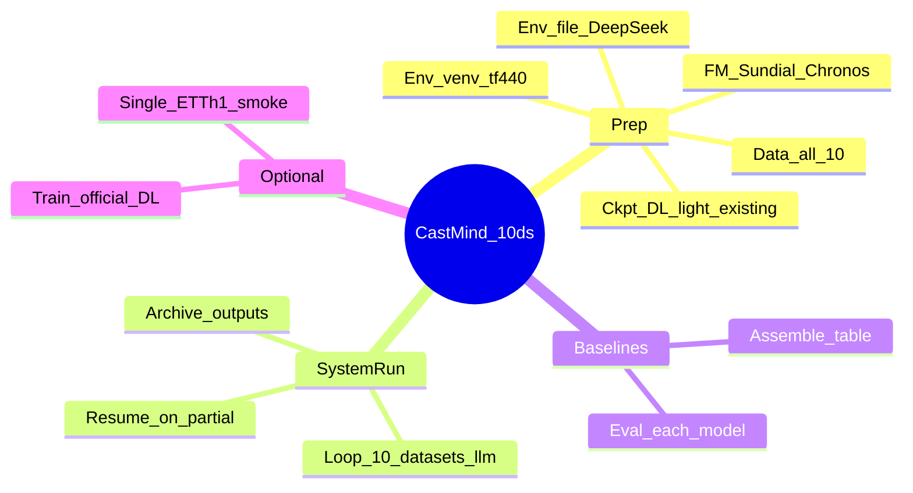
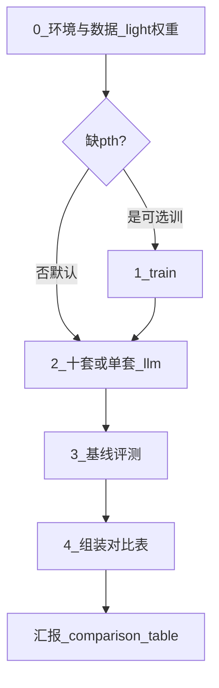
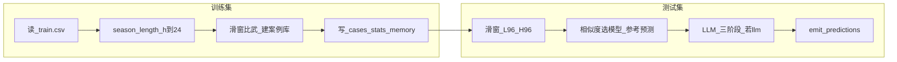

# CastMind 跑数思维导图与逐步操作

> **若你要「与论文对齐」的导图**，请看根目录 **[PAPER_ALIGNMENT.md](./PAPER_ALIGNMENT.md)**（协议 / 方法集 / 可对齐 vs 残差）。  
> 本文是**怎么跑起来**的操作树；可复制短命令见 [RUNBOOK.md](./RUNBOOK.md)。



---

## 总览：推荐顺序

| 顺序 | 阶段 | 目的 | 主命令 |
|:---:|------|------|--------|
| 0 | 准备 | 环境 / 数据 / light 权重 | `setup_env.sh` |
| 1 | （可选）自训 DL | 仅缺权重时 | `train_checkpoints.py` |
| 2 | 跑系统 | 单套或十套 LLM | `run.sh --dataset …` / 见 [RUNBOOK §4](./RUNBOOK.md) |
| 3 | 基线+对比表 | Table 1 风格 | `eval_baselines` → `assemble` |



---

## 分支 0：准备（只做一次或变更时）

### 0.1 进入仓库

```bash
cd /Users/bandaoxu/Desktop/毕设/CastMind
```

### 0.2 创建/刷新主环境

**做什么：** 安装依赖并钉死 `transformers==4.40.1`（否则 Sundial 进不了池）。

```bash
bash scripts/setup_env.sh
source .venv/bin/activate
```

**验收：**

```bash
.venv/bin/python -c "import transformers; print(transformers.__version__)"
# 必须是 4.40.x
```

### 0.3 配置 `.env`

**做什么：** 模式与 LLM 密钥（勿提交 git）。

```bash
cp -n .env_template .env
# 编辑 .env
```

| 变量 | 含义 | 示例 |
|------|------|------|
| `ORCHESTRATION_MODE` | `llm` 全测试窗 / `deterministic` 冒烟 | `llm` |
| `OPENAI_BASE_URL` | DeepSeek API | `https://api.deepseek.com/v1` |
| `OPENAI_API_KEY` | 密钥 | （自填） |
| `MODEL` | 模型名 | `deepseek-chat` |
| `CASTMIND_AUTO_ARCHIVE` | 跑完归档 | `1` |

### 0.4 数据

**做什么：** 保证 `data/ETTh1/train.csv`、`data/ETTh1/test.csv` 存在。

```bash
ls data/ETTh1/train.csv data/ETTh1/test.csv
# 若缺失：python scripts/prepare_data.py   # 需网络
```

**协议（config.yaml / ETTh1）：** `look_back=96`，`predicted_window=96`，`sliding_window=96`，`frequency=h`。

### 0.5 权重与基础模型

| 类型 | 路径 | 操作 |
|------|------|------|
| DL light（默认） | `castmind/DeepLearningCheckpoints/<ds>/` 五模型 `.pth` | 本轮默认；**不跑 TimeXer**；`config.yaml` 已指向 |
| DL official（可选） | `…/<ds>_official/` | 仅缺权重或刻意换预设时自训 |
| Sundial | `castmind/foundation_models/sundial-base-128m/` | 需已下载；主环境 tf4.40 才会入池 |
| Chronos | `castmind/foundation_models/chronos-bolt-base/` | 需已下载 |

**验收池（无 DL 上下文时至少含统计+FM）：**

```bash
.venv/bin/python -c "from castmind.models.base import get_default_models; print([m.alias for m in get_default_models()])"
# 期望含 Sundial、Chronos；有 ckpt 且 configure 后才有 DLinear 等
```

---

## 分支 1：（可选）自训 DL official

**本轮默认跳过。** 仅在缺 `.pth` 或要换 official 预设时：

```bash
.venv/bin/python scripts/train_checkpoints.py \
  --datasets ETTh1 --preset official --epochs 10
```

**产出：** `castmind/DeepLearningCheckpoints/ETTh1_official/*.pth`（**不是**作者官方权重）。

---

## 分支 2：跑 CastMind 系统（核心）

### 2.1 启动方式

**单套（推荐；有 resume 时同命令续跑）：**

```bash
ORCHESTRATION_MODE=llm bash scripts/run.sh --dataset ETTh1
# EPF 优先：EPF_NP → … → EPF_DE；再 ETTh1 / ETTm1；代理数据集最后
```

**分批串行（一套失败 exit 1 则 stop，勿去掉 `|| break`）：**

```bash
for ds in EPF_NP EPF_PJM EPF_BE EPF_FR EPF_DE; do
  echo "===== $ds ====="
  ORCHESTRATION_MODE=llm bash scripts/run.sh --dataset "$ds" || break
done
for ds in ETTh1 ETTm1 windy_power sunny_power MOPEX; do
  echo "===== $ds ====="
  ORCHESTRATION_MODE=llm bash scripts/run.sh --dataset "$ds" || break
done
```

完整命令与清 resume 从零重跑见 [RUNBOOK.md §4](./RUNBOOK.md)。

### 2.2 内部步骤（系统自动做，便于对照日志）



| 子步 | 发生什么 | 你怎么看 |
|------|----------|----------|
| 案例库 | 训练窗上各基线比 MSE，赢家写入 case | `outputs/ETTh1/cases_stats.json` |
| 季节 | `frequency=h` → `periodicity_lag=24` | `outputs/ETTh1/memory.json` |
| 每测试窗 | consult → CoT → emit | `chain_of_thought.log` |
| 汇总 | MSE/MAE/sMAPE | 终端 `Experiment Summary` |
| 归档 | 复制到 `_archive/` | `outputs/_archive/ETTh1_llm_deepseek/` 等 |

### 2.3 Deterministic 注意

```bash
ORCHESTRATION_MODE=deterministic bash scripts/run.sh --dataset ETTh1
```

会重建案例库，但**预测多为单窗冒烟**，全测试窗指标请用 **llm**。

### 2.4 产物清单

- `outputs/ETTh1/predictions.csv`
- `outputs/ETTh1/cases_stats.json` / `case_base.json` / `case_neighbor.json`
- `outputs/ETTh1/memory.json`
- `outputs/ETTh1/chain_of_thought.log`

---

## 分支 3：基线独立评测 + 对比表

### 3.1 各方法单独测测试集

```bash
# --from-archive 必须放末尾（nargs=*）
bash scripts/run.sh scripts/eval_baselines_table.py \
  --datasets EPF_NP EPF_PJM EPF_BE EPF_FR EPF_DE ETTh1 ETTm1 windy_power sunny_power MOPEX \
  --from-archive
```

**做什么：** 对池中每个模型按该数据集协议滑窗预测，算 MSE/MAE；并读取归档里的 CastMind 预测（`--from-archive`）。无 TimeXer 权重则该行 `—`。  
**不是** `run_experiment.py`（那是 CastMind 系统编排）。

**产出：** `outputs/comparison/<ds>_baselines.json` + `*_castmind_*.json`

### 3.2 组装论文对照表

```bash
.venv/bin/python scripts/assemble_comparison_table.py \
  --datasets EPF_NP EPF_PJM EPF_BE EPF_FR EPF_DE ETTh1 ETTm1 windy_power sunny_power MOPEX
```

论文数字来自 `scripts/paper_table1_reference.json`（十套齐全）。  
**读表：** 版式可对照 Table 1；数值不宣称复现（DeepSeek / light / EPF 短覆盖 / 代理数据）。

**产出：**

- [`docs/comparison_table.md`](docs/comparison_table.md)
- `outputs/comparison/table1_local.md` / `.csv`

---

## 分支 4：换数据集 / 汇报

- 换数据：`--dataset ETTm1`（或 `EPF_NP` 等），协议见 `config.yaml`。
- 汇报口径：公开权重可近比；自训 DL + DeepSeek 不宣称对齐作者主表。
- 数据缺口（WP/SP/MOPEX）：[`docs/数据缺口_Windy_Sundy_MOPEX.md`](docs/数据缺口_Windy_Sundy_MOPEX.md)。
- 周报素材：[`docs/工作进展.md`](docs/工作进展.md)、[`docs/周报模板.md`](docs/周报模板.md)。
---

## 故障速查

| 现象 | 处理 |
|------|------|
| 池无 Sundial | 确认 tf 4.40.x + `foundation_models/sundial-base-128m` 存在 |
| DL 未入池 | `config.yaml` 路径存在且 `configure_deep_learning_runtime` 已跑（正式实验会配） |
| 无 TimeXer | 预期：本轮不跑；对比表该行空缺 |
| Prophet 爆炸 | 短窗勿开 yearly（代码已按历史长度限制） |
| LLM 中断 / Empty Summary | 查 `outputs/<ds>/llm_resume_state.json`；同命令重跑；未完整结束不会自动 Archived |
| Reflector 拒收 3 次 | 会 pause 写 resume；续跑即可 |
| EPF 旧跑约 408–432 点 | 曾误用 `sliding_window=168`；现已改为 **24**（约 2856 点），须重跑 |
| 对比表缺 CastMind 行 | 先有 `outputs/_archive/<ds>_llm_deepseek/predictions.csv`，再 `--from-archive` |
